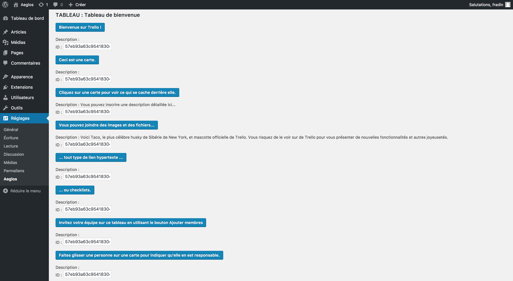

# WPTrello

WPTrello est un plugin permettant de se connecter à son compte Trello dans l'espace admin de son interface Wordpress.

Ainsi, cela permet de lister ses boards, cards, webhooks et de voir les tâches qu'il nous reste à faire tout en restant sur son interface.

Pour que celui-ci fonctionne, il suffira de récupérer votre app-key, et de le remplacer dans le fichier aeglos.php en remplacement de la chaine "[APP-KEY]" ligne 28.

